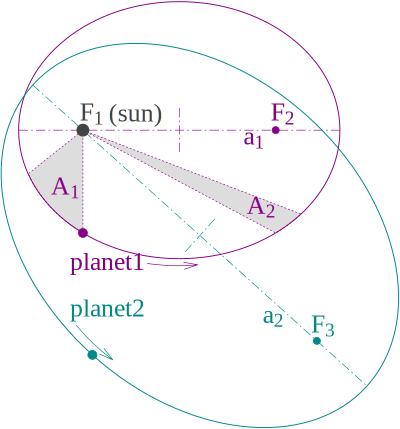
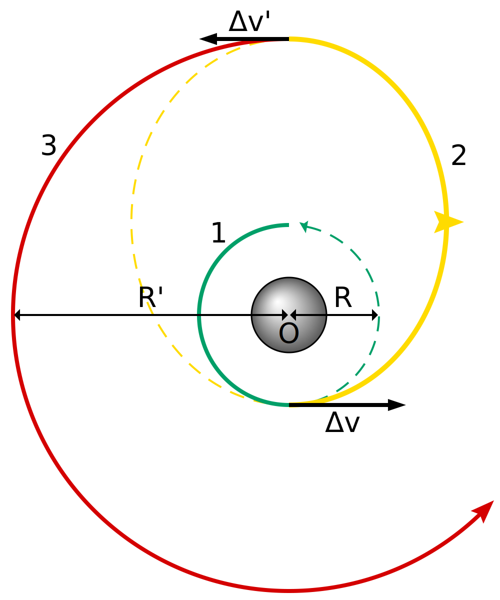
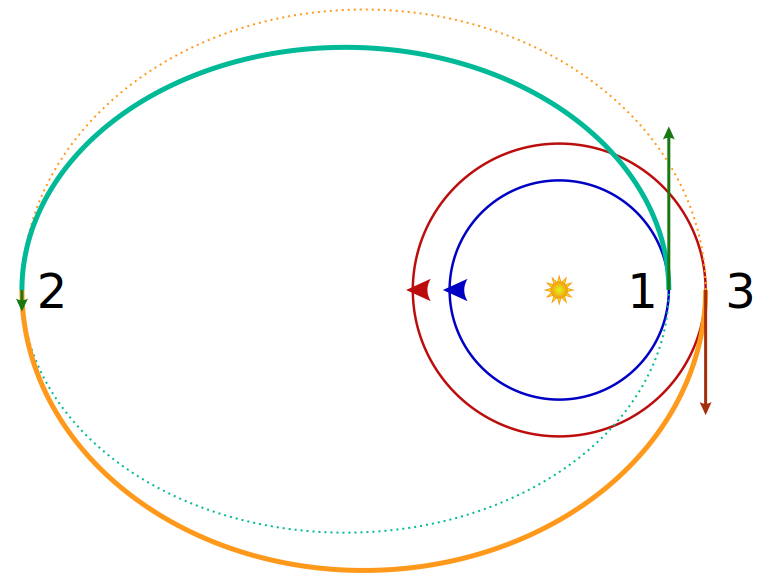
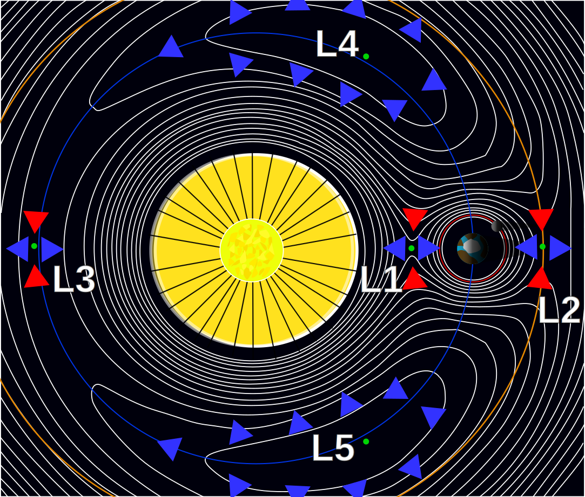
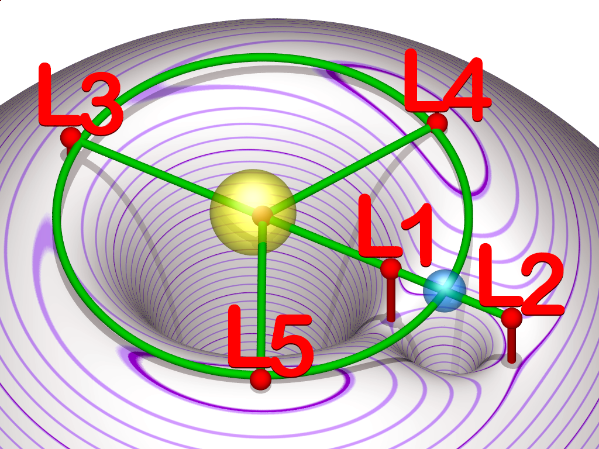
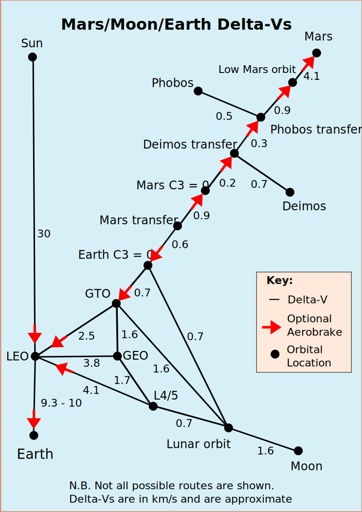

# 03 — Mecánica orbital / Astrodinámica

El corazón matemático del negocio. Sin fluidez en esto no se puede dimensionar una misión, negociar un lanzamiento, o validar un payload.


*Leyes de Kepler — el punto de partida histórico y conceptual. Imagen: Wikimedia Commons, dominio público.*

## 1. El problema de dos cuerpos

### Ecuación fundamental
```
r̈ = −(μ/r³) r       donde μ = G(M+m) ≈ GM
```

Para Tierra: μ⊕ = 398,600.4418 km³/s².
Para Sol: μ☉ = 1.32712440018 × 10¹¹ km³/s².
Para Luna: μ☾ = 4902.8000 km³/s².

### Constantes del movimiento
- Energía específica: `ε = v²/2 − μ/r = −μ/(2a)`
- Momento angular específico: `h = r × v`, magnitud `h = √(μa(1−e²))`
- Vector de excentricidad: `e = (v × h)/μ − r̂`

### Órbitas cónicas
Según energía:
| ε | a | e | Tipo |
|---|---|---|------|
| <0 | >0 | 0 | Circular |
| <0 | >0 | 0<e<1 | Elíptica |
| =0 | ∞ | 1 | Parabólica |
| >0 | <0 | >1 | Hiperbólica |

### Ecuación de la órbita (polares)
```
r(ν) = p / (1 + e cos ν)       con  p = a(1−e²) = h²/μ
```

### Período orbital (Kepler III)
```
T = 2π √(a³/μ)
```

## 2. Elementos orbitales clásicos (COE)


*Los seis elementos keplerianos: a, e, i, Ω, ω, ν. Imagen: Wikimedia Commons, CC-BY-SA.*

Seis parámetros que definen una órbita en el espacio inercial:

| Símbolo | Nombre | Descripción |
|---------|--------|-------------|
| a | Semieje mayor | Tamaño |
| e | Excentricidad | Forma |
| i | Inclinación | Ángulo plano orbital vs ecuador |
| Ω | RAAN | Longitud nodo ascendente |
| ω | Argumento perigeo | Orientación elipse en plano orbital |
| ν (o M o E) | Anomalía verdadera (o media o excéntrica) | Posición a lo largo de la órbita |

### Relaciones entre anomalías (órbita elíptica)

**Anomalía media**:
```
M = n (t − t_p)     con  n = √(μ/a³)
```

**Ecuación de Kepler** (resolver iterativamente, p.ej. Newton-Raphson):
```
M = E − e sin E
```

**Anomalía verdadera**:
```
tan(ν/2) = √((1+e)/(1−e)) · tan(E/2)
```

### Órbitas especiales
- **LEO** — 200-2000 km altitud. Típico: ISS ~400 km, Starlink ~550 km, Earth obs ~500-800 km.
- **Heliosíncrona (SSO)** — inclinación ~98° a 700-800 km, usa J2 para mantener geometría solar constante. Estándar para Earth observation.
- **MEO** — GPS 20,200 km i=55°, Galileo 23,222 km i=56°.
- **GEO** — 35,786 km, i=0, e=0. Período 23h56min4s (sideral).
- **Molniya / Tundra** — altamente excéntricas, i=63.4° (argumento de perigeo no regresa por J2).
- **Lunar NRHO** (Near-Rectilinear Halo Orbit) — usada por Gateway, estable, ~9:2 resonancia con rotación lunar.
- **L1/L2 Halo** (Sol-Tierra) — JWST, SOHO, Herschel. Lagrange points.


*Comparación a escala: LEO (ISS), MEO (GPS, Galileo), GEO. Imagen: Wikimedia Commons.*

## 3. Maniobras orbitales

### Impulso finito vs instantáneo
Para estudio de misión se asume maniobras impulsivas (Δv instantáneo). Para diseño real con bajo empuje se integra la ecuación de Tsiolkovsky con perfiles de thrust continuo.

### Transferencia Hohmann (dos impulsos, coplanar)


*Dos quemas tangenciales entre órbitas circulares coplanares. Imagen: Wikimedia Commons.*

De órbita circular r1 a r2, r2 > r1:
```
Δv1 = √(μ/r1) · (√(2r2/(r1+r2)) − 1)
Δv2 = √(μ/r2) · (1 − √(2r1/(r1+r2)))
Δv_total = Δv1 + Δv2
```
Tiempo de transferencia:
```
τ = π √((r1+r2)³/(8μ))
```

**Ejemplo — LEO (6571 km) a GEO (42,164 km)**:
- v_LEO = 7.786 km/s, v_perigeo_transfer = 10.252 km/s, Δv1 = 2.466 km/s
- v_apogeo_transfer = 1.598 km/s, v_GEO = 3.075 km/s, Δv2 = 1.477 km/s
- Total Δv = 3.943 km/s, tiempo = 5h15min.

### Bi-elíptica (tres impulsos)


*Tres impulsos, atajo por un apoapsis alto. Imagen: Wikimedia Commons.*

Más eficiente que Hohmann sólo para r2/r1 > 11.94. Útil para transferencias lunares desde LEO (cislunar transfer).

### Cambio de plano (plane change)
Cambio puro de inclinación en punto de órbita circular:
```
Δv = 2 v sin(Δi/2)
```

**Lección**: los cambios de plano son carísimos. Para Δi = 30° a LEO (v=7.8 km/s): Δv = 4.04 km/s — **más caro que subir a GEO**. Por eso se lanza con la inclinación objetivo desde el principio.

### Cambio combinado (inclinación + órbita)
Hacer el cambio de plano en apogeo (donde v es menor) reduce el Δv total. Es la razón por la cual las misiones GEO suelen combinar el último burn Hohmann con el cambio de plano.

### Efecto Oberth
Los impulsos en puntos de alta velocidad (perigeo) son energéticamente más eficientes porque entregan más energía por kg de propelente:
```
ΔKE = m v · Δv
```
A velocidad v=10 km/s un Δv=1 km/s entrega 10× más energía cinética que a v=1 km/s.

**Consecuencia**: las misiones interplanetarias hacen sus burns finales pasando cerca de un cuerpo (Earth Oberth maneuver, flyby de Júpiter).

## 4. Rendezvous y operaciones de proximidad

### Ecuaciones de Clohessy-Wiltshire (Hill-Clohessy-Wiltshire, CW)
Movimiento relativo linealizado entre un "chaser" y un "target" en órbita circular. Sistema de referencia LVLH (x radial, y along-track, z cross-track).

**Ecuaciones linealizadas**:
```
ẍ − 2n ẏ − 3n² x = u_x / m
ÿ + 2n ẋ         = u_y / m
z̈ + n² z         = u_z / m
```
n = movimiento medio del target.

Sin control (u=0) la solución analítica cerrada permite planear acercamientos V-bar, R-bar, football orbits.

**Transferencia de dos impulsos entre estados (Lambert CW)** — útil para diseño de maniobras de proximidad.

### Escenarios típicos
- **V-bar approach**: aproximación a lo largo del vector velocidad. Estable, usado ISS.
- **R-bar approach**: aproximación radial (de abajo). Intrínsecamente estable sin thrust — se usa porque el chaser "cae" naturalmente si falla propulsión.
- **Football orbits**: órbitas relativas naturales no-impulsivas de inspección.

### Referencia crítica
- Fehse, "Automated Rendezvous and Docking of Spacecraft".
- Curtis cap. 7 (nivel introductorio).

## 5. Perturbaciones principales y propagación

### Método Cowell
Integración numérica directa de `r̈ = a_total` con todas las perturbaciones sumadas. Simple, preciso, lento.

### Variación de parámetros (VOP)
En lugar de integrar r, v directamente, se integran los elementos orbitales (que son constantes en 2-body). Las ecuaciones de Gauss / Lagrange dan dC_i/dt en función de las perturbaciones.

### Perturbaciones J2 secular (aproximación analítica)
```
Ω̇ = −(3/2) n J2 (R⊕/p)² cos i
ω̇ = +(3/4) n J2 (R⊕/p)² (4 − 5 sin² i)
Ṁ₀ = (3/4) n J2 (R⊕/p)² √(1−e²) (3 sin² i − 2)   [corrección]
```

**Inclinación crítica**: sin² i = 4/5 → i = 63.4349° hace ω̇ = 0. Usado en Molniya.

### Modelos de alta fidelidad
- **EGM2008 / EGM96** — gravedad terrestre (hasta grado/orden 2190).
- **JPL DE440 / DE441** — efemérides planetarias.
- **JB2008, NRLMSISE-00** — atmósfera.
- **IAU 2006/2000A** — precesión, nutación, rotación terrestre.

## 6. Transferencias interplanetarias — cónicas parchadas (patched conics)

### Método
Dividir la trayectoria en tramos donde domina un único cuerpo (esferas de influencia, SOI):
1. **Partida**: hiperbólica respecto a la Tierra hasta cruzar SOI terrestre.
2. **Transferencia heliocéntrica**: elipse alrededor del Sol.
3. **Llegada**: hiperbólica respecto al cuerpo objetivo.

### Radio de SOI (Hill sphere, aproximación Laplace)
```
r_SOI = a_pl (m_pl / M☉)^(2/5)
```

| Cuerpo | r_SOI (km) |
|--------|------------|
| Tierra | 924,000 |
| Luna | 66,100 |
| Marte | 577,000 |
| Júpiter | 48,200,000 |

### C3 (característica de energía de partida)
```
C3 = v_∞²    [km²/s²]
```
Energía específica = C3/2. Es la métrica que las hojas de datos de lanzadores usan para capacidad interplanetaria.

**Ejemplo — Tierra a Marte (Hohmann)**:
- v_∞_partida ≈ 2.94 km/s → C3 ≈ 8.64 km²/s²
- v_∞_llegada ≈ 2.65 km/s
- Δv_LEO→hiperbólica ≈ 3.6 km/s (sobre la velocidad LEO)
- Ventanas de lanzamiento cada ~26 meses.

### Problema de Lambert
Dado un punto inicial r1, un punto final r2, y un tiempo de vuelo Δt, encontrar la órbita de transferencia. Es el problema central en diseño de trayectorias.

**Algoritmos**: Gooding, Izzo (rápido, robusto), Battin. Implementado en Poliastro, Orekit, GMAT.

### Porkchop plots
Gráfico 2D (fecha partida × fecha llegada) con contornos de C3 y v_∞_arrival. Herramienta estándar para selección de ventanas.

## 7. Asistencia gravitacional (flybys)

Aprovechar el momento angular de un planeta. Un flyby cambia la magnitud **y** la dirección del v_∞ respecto al Sol sin gastar propelente.

**Teorema**: el ángulo de deflexión δ depende de la distancia de máximo acercamiento r_p:
```
sin(δ/2) = 1 / (1 + r_p v_∞² / μ_planeta)
```

**Misiones clásicas**: Voyager 1/2 (Júpiter, Saturno, Urano, Neptuno), Cassini (Venus×2, Tierra, Júpiter), Parker Solar Probe (Venus×7).

Para una startup LatAm con capacidad limitada, un flyby de Tierra o Venus puede ser la diferencia entre poder alcanzar un NEO y no poder.

## 8. Trayectorias de bajo empuje (low-thrust)

La ecuación del cohete falla como aproximación cuando los burns son de semanas/meses en vez de minutos. La trayectoria es una espiral suave, no una cónica.

### Régimen
- Thrust/peso >> 1 → impulsivo, cónicas parchadas válidas.
- Thrust/peso << 1 → continuo, requiere integración completa.

### Aproximación de espiral (Edelbaum para cambios de a e i)
Para electroprop con Isp y empuje constante:
```
Δv_total ≈ √(v1² − 2 v1 v2 cos(π Δi/2) + v2²)     (aproximación cambio combinado)
```
Simplificación para cambio puro de altitud circular:
```
Δv ≈ |v1 − v2|
```
pero aumenta por geometría de espiral — la versión exacta es dependiente de trayectoria.

### Software
- **GMAT** (NASA, gratis) — low-thrust con ProNav, resolución iterativa.
- **Copernicus** (NASA, restringido).
- **pyKEP / pagmo** (ESA, libre) — optimización global de trayectorias con algoritmos evolutivos.
- **Astrogator** (en STK) — comercial.

## 9. Puntos de Lagrange y mecánica restringida de tres cuerpos


*Los cinco puntos de equilibrio del CR3BP. L1/L2/L3 colineales (inestables), L4/L5 triangulares (estables si m1/m2 > 24.96). Imagen: Wikimedia Commons.*


*Contornos de potencial efectivo en marco rotante. Los L-points son máximos (L4/L5) o puntos de silla (L1/L2/L3). Imagen: Wikimedia Commons.*

### Problema restringido circular de tres cuerpos (CR3BP)
Dos primaries masivos en órbita circular alrededor del CM, tercer cuerpo de masa despreciable. Marco rotante ligado a las primaries.

### Cinco puntos de equilibrio
- **L1, L2, L3**: colineales, inestables (time constant ~días-semanas).
- **L4, L5**: triangulares, estables si m1/m2 > 24.96 (Sun-Earth, Earth-Moon cumplen).

### Ubicaciones (distancias desde primary 2)
Para Sistema Sol-Tierra (μ = m_⊕/(m☉+m_⊕) ≈ 3.04 × 10⁻⁶):
- L1: ~1,491,000 km (hacia Sol).
- L2: ~1,505,000 km (opuesto al Sol). **JWST, Gaia, Euclid**.
- L3: aprox. 1 AU al otro lado del Sol.

Para Tierra-Luna:
- L1: ~326,400 km.
- L2: ~449,100 km.

### Órbitas periódicas alrededor de Lagrange points
- **Halo orbits** — 3D, usadas por JWST, ARTEMIS, Gateway.
- **Lissajous orbits** — quasi-periódicas.
- **NRHO (Near-Rectilinear Halo)** — family of halo orbits cerca de Earth-Moon L1/L2, elegida para Gateway.

### Constante de Jacobi y regiones prohibidas
```
C = 2·U(x,y,z) − v²     (en marco rotante)
```
C > C_crit implica acceso restringido (Hill regions). Define qué trayectorias son posibles sin propulsión.

### Redes de bajo-energía (Low Energy Transfers, LET)
Trayectorias que explotan manifolds invariantes de órbitas periódicas para transferir entre L1/L2 de distintos sistemas casi sin Δv. Usado por Hiten (Japón, 1990) para ir a la Luna con propelente mínimo.

### Referencia imprescindible
- Koon, Lo, Marsden, Ross, "Dynamical Systems, the Three-Body Problem and Space Mission Design" — PDF gratuito online.

## 10. Δv budgets de referencia


*Δv aproximado entre cuerpos del sistema solar interno. Sumar valores a lo largo del camino elegido. Imagen: Wikimedia Commons.*

| Maniobra | Δv (m/s) |
|----------|----------|
| LEO → GEO (Hohmann + plane change en GEO) | 3,900-4,200 |
| LEO → GTO (GEO Transfer Orbit) | 2,460 |
| GTO → GEO (apogeo, combinado) | 1,450-1,800 |
| LEO → Lunar Transfer (TLI) | 3,150 |
| Lunar Orbit Insertion (LOI) | 800-900 |
| Lunar landing (desde LLO 100km) | 1,870 |
| LEO → Mars Transfer Orbit | 3,600 |
| Mars Capture (elipse) | 2,100 |
| Mars landing (EDL desde orbita) | ~4,000 (mayoría aerobraking) |
| LEO → típico NEO (bajo Δv, ej. 2001 QJ142) | 3,800-5,500 |
| LEO → Venus Transfer | 3,500 |
| LEO → Jupiter (direct) | 6,300 |
| LEO → Jupiter (VEEGA flyby) | 4,000 |
| Estación de proximidad (Hohmann corto) | 10-50 |
| Docking terminal | 1-10 |

## 11. Mecánica orbital con relatividad (casos extremos)

Sólo relevante para:
- Cerca del Sol (Parker Solar Probe a 6.9 millones de km).
- Navegación de alta precisión (GPS, Galileo).
- Cualquier cosa cerca de un objeto muy masivo o en un campo gravitatorio fuerte.

Efecto dominante: precesión anómala del perihelio — 43"/siglo para Mercurio, 14.3 m/órbita para Parker.

## 12. Herramientas recomendadas (software)

| Software | Propósito | Licencia |
|----------|-----------|----------|
| **GMAT** | Diseño y análisis de misión | Open source (NASA) |
| **Orekit** | Biblioteca Java de astrodinámica | Open source (CS GROUP) |
| **Poliastro** | Python, intro-intermedio | Open source |
| **Skyfield** | Python, efemérides | Open source |
| **Astropy** | Python, astronomía general | Open source |
| **STK** | Análisis operacional de misiones | Comercial (Ansys) |
| **FreeFlyer** | Ops y análisis | Comercial |
| **Copernicus** | Trayectorias optimizadas | NASA restringido |
| **MONTE** | Navegación deep-space | JPL restringido |
| **pyKEP** | Optimización trayectorias | Open source (ESA) |

## Libros imprescindibles (orden de lectura)

1. **Curtis — Orbital Mechanics for Engineering Students** — texto de introducción moderno, con código MATLAB. Leerlo completo y resolver problemas.
2. **Bate, Mueller, White — Fundamentals of Astrodynamics** — clásico, denso, barato (Dover). 
3. **Vallado — Fundamentals of Astrodynamics and Applications** — referencia definitiva. 1000+ páginas, código incluido.
4. **Battin — An Introduction to the Mathematics and Methods of Astrodynamics** — avanzado. Después de Vallado.
5. **Koon, Lo, Marsden, Ross — Dynamical Systems, Three-Body Problem and Space Mission Design** — para mecánica moderna no-keplerian.
