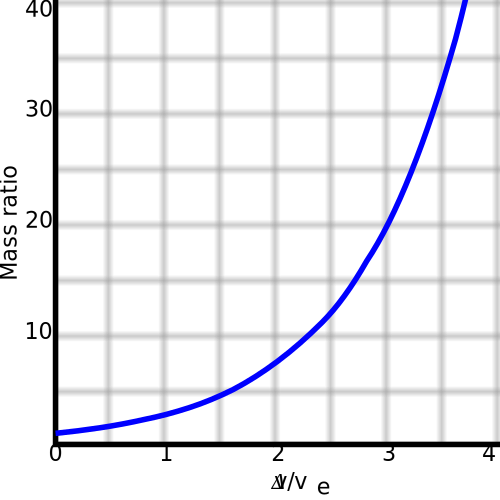
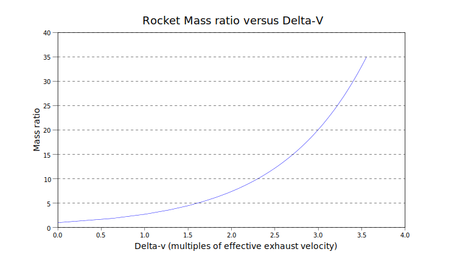

# 04 — Propulsión espacial

Todo lo que se hace en el espacio depende de la propulsión. Esta nota explica la física y da los cálculos que se usan para dimensionar misiones reales.

## 1. La ecuación fundamental — Tsiolkovsky


*La ecuación del cohete. Imagen: Wikimedia Commons.*

```
Δv = v_e · ln(m₀ / m_f) = Isp · g₀ · ln(m₀ / m_f)
```

Donde:
- Δv = cambio de velocidad (m/s)
- v_e = velocidad de escape efectiva del propelente (m/s)
- Isp = impulso específico (s)
- g₀ = 9.80665 m/s² (constante, **no** la gravedad local)
- m₀ = masa inicial (con propelente)
- m_f = masa final (seca + payload)

### Fracción de masa de propelente
```
m_p / m₀ = 1 − exp(−Δv / (Isp · g₀))
```

### Relaciones operativas
- Δv = v_e → propelente = 63.2% de masa inicial.
- Δv = 2 v_e → propelente = 86.5%.
- Δv = 3 v_e → propelente = 95.0%.

Esto es la **tiranía de la ecuación del cohete**: cada Isp adicional multiplica exponencialmente la carga útil posible para Δv altos.


*Ratio de masas (m₀/m_f) requerido en función del Δv/v_e. Nota la explosión exponencial cuando Δv > 2 v_e. Imagen: Wikimedia Commons.*

### Staging (etapas)
Descartar masa estructural a medida que se vacían tanques. Cada etapa tiene su propio Tsiolkovsky y el Δv total se suma:
```
Δv_total = Σ Isp_i · g₀ · ln(m₀_i / m_f_i)
```
El óptimo de etapas es un problema de Lagrange multiplier — típicamente 2-3 etapas para LEO, 3-4 para GTO/TLI.

## 2. Impulso específico — Isp

Isp mide **eficiencia de propelente**, no empuje. Thrust y Isp son independientes.

### Tabla de Isp por tipo de motor

| Tipo | Isp típico (s) | Notas |
|------|----------------|-------|
| Mono-propelente hidrazina | 220-235 | MMH con N2O4: 280-290. Confiable, para control de actitud. |
| Bi-propelente almacenable | 300-340 | MMH/N2O4, UH25/N2O4. Satélites GEO. |
| Kerolox (RP-1 / LOX) | 260-310 (SL) / 330-360 (vac) | Merlin, F-1, Rutherford. Denso, manejable. |
| Metalox (CH4 / LOX) | 310-340 (SL) / 360-380 (vac) | Raptor, BE-4, Archimedes. Reusable-friendly. |
| Hidrolox (LH2 / LOX) | 380-420 (SL) / 450-475 (vac) | RS-25, Vulcain, LE-9. Alto Isp, baja densidad. |
| Sólido | 240-280 | PBAN, HTPB. Simple, no modulable. Boosters. |
| Híbrido (LOX + parafina) | 280-340 | SpaceShipTwo. Nicho emergente. |
| Nuclear térmico (NTR) | 850-1000 | NERVA. No demostrado comercial. |
| Resistojet / Arcjet | 300-1000 | Electrocalentamiento. Baja potencia. |
| Hall thruster (Xe) | 1500-2500 | SPT-100, BPT-4000, XR-5. Starlink, GEO. |
| Ion gridded (Xe) | 3000-4500 | NSTAR (Dawn), NEXT, XIPS. |
| Ion gridded avanzado (Xe) | hasta 9000 | JPL NEXT-C demonstrated. |
| MPD | 2000-5000 | MW-class, no operacional. |

g₀ · Isp = v_e. Isp en segundos es convenient pero v_e en m/s es lo físicamente significativo.

## 3. Empuje y flujo másico

### Empuje
```
F = ṁ · v_e + (p_e − p_∞) · A_e
```
Primer término: empuje de momento. Segundo: empuje de presión.

### Empuje en vacío (óptimo cuando tobera expande a p_e = 0 — no realizable, pero límite)
En la práctica las toberas se diseñan para:
- **First stage / sea level**: p_e ≈ p_atmosférica al nivel del mar (~100 kPa).
- **Upper stage / vacuum**: p_e lo más bajo posible sin separación de flujo (tobera expansion ratio 60-300).

### Razón de expansión (ε)
```
ε = A_e / A_t
```
Típico SL: 10-20. Típico vacuum: 80-250 (RL-10: ~285).

## 4. Combustibles y oxidantes

### Propelentes químicos bi-propelente

**LOX / Kerosene (RP-1)**
- Densidad alta (~1080 kg/m³ combinado), buena para tanques pequeños.
- Manejable, relativamente seguro.
- Coking problems en reuso — RP-1 deja depósitos carbonosos.
- Usado: Falcon 9 (Merlin), Soyuz, Electron.

**LOX / LH2**
- Isp más alto de los químicos (450+ vacío).
- Densidad muy baja (LH2 70 kg/m³) → tanques grandes.
- Temperatura cryo extrema (20 K), boil-off.
- Usado: RS-25 (Shuttle/SLS), RL-10, Vulcain, LE-9.

**LOX / CH4 (metalox)**
- Isp intermedio (360-380 vacuum).
- Densidad razonable (~830 kg/m³).
- Clean burn, reusable-friendly.
- ISRU en Marte: metano sintetizable con Sabatier.
- Usado: Raptor (SpaceX), BE-4 (Blue Origin), Archimedes (Rocket Lab Neutron), Prometheus (ESA).

**Almacenables (MMH/N2O4, UDMH/N2O4, Hidrazina)**
- No requieren refrigeración.
- Hipergólicos (ignición espontánea al contactar — alta confiabilidad).
- **Tóxicos** (cáncer, ambiente). Regulaciones crecientes.
- Usado: órbita operacional de satélites, motor lunar Apollo, Soyuz para control.

### Propelentes "verdes" emergentes
- **AF-M315E (ASCENT)** — hidroxylamonio nitrate. Isp 250-260. Menos tóxico. GPIM de NASA, satélites comerciales.
- **LMP-103S** — ADN-based, sueco. Prisma demostró.
- **HTP (peróxido de hidrógeno)** — tanque único concentrado (+85%), monopropelente. Usado por Skyrora, Stoke Space.

### Propelentes eléctricos
- **Xenón** — estándar histórico. USD 1500-3000/kg. Escaso (subproducto de separación criogénica de aire).
- **Kriptón** — USD 150-500/kg. Isp ~5% menor que Xe. Adoptado por Starlink.
- **Yodo** — almacenable a STP sólido, bajo costo, alta densidad. ThrustMe demostrado. Issue: corrosión.
- **Agua** (electrolisis → H2+O2 resistojet o thruster bipropelente) — conceptual para in-space.

## 5. Ciclos de motores cohete

Los diagramas siguientes muestran el flujo de combustible y oxidante en cada arquitectura. Preguntarse siempre: *¿dónde se pierde Isp?* (gas generator → descarga por overboard) vs *¿dónde se gana?* (staged combustion → todo termina en la cámara).

### Pressure-fed
Tanques presurizados empujan propelente. Simple, sin turbobombas. Limitado a baja presión de cámara (<10 bar típico).
- Usado: motores de reacción control, upper stages pequeños, Stoke Hopper.

### Gas generator (ciclo abierto)


*Gas generator: los gases de turbina se descartan — pérdida de Isp a cambio de simplicidad. Imagen: Wikimedia Commons.*

Fracción pequeña del propelente quemado en pre-combustor a mezcla baja (rica en combustible) para turbina que mueve bombas. Los gases de turbina se expulsan sin más uso → pérdida de Isp.
- Simple, relativamente barato.
- Usado: F-1 (Saturn V), Merlin, Raptor genera-gás en prototipos previos, Rutherford (eléctrico-drive en realidad).

### Staged combustion (ciclo cerrado)


*Staged combustion: los gases de turbina van a la cámara principal. Ganancia de Isp, costo en complejidad térmica. Imagen: Wikimedia Commons.*

Pre-combustor descarga en la cámara principal. No hay pérdida. Más complejo, Isp más alto.
- **Oxidizer-rich staged combustion (ORSC)**: común en motores rusos (RD-180, RD-170). Turbina corre con gas oxidante — requiere metalurgia especial.
- **Fuel-rich staged combustion**: SSME/RS-25. Turbina con gas reductor — más benigno químicamente.
- **Full-flow staged combustion (FFSC)**: dos pre-combustores (uno fuel-rich, uno ox-rich), ambos gaseificados antes de cámara principal. SpaceX Raptor (primero operacional).


*FFSC: ambos propelentes pasan por turbinas antes de la cámara. El esquema del Raptor. Imagen: Wikimedia Commons.*

### Expander cycle


*Expander: el combustible se vaporiza regenerativamente y mueve la turbina. Sin pre-combustor. Imagen: Wikimedia Commons.*

Combustible (típicamente LH2 o CH4) absorbe calor regenerativo, se vaporiza, mueve turbina, y se inyecta en cámara. Sin pre-combustor. Limitado por superficie disponible para calentar.
- Confiable, limpio.
- Usado: RL-10, Vinci, LE-9 (closed expander bleed).

### Electric pump (electric-driven)


*Electric pump: motor eléctrico + baterías reemplazan la turbobomba. El esquema del Rutherford. Imagen: Wikimedia Commons.*

Bombas movidas por motor eléctrico con baterías Li-Ion. Elimina turbobomba compleja.
- Rocket Lab Rutherford primero operacional.
- Penalidad: masa de baterías (se descartan con la etapa).

### Tabla resumen

| Ciclo | Complejidad | Isp vac típ. | Ejemplos |
|-------|-------------|--------------|----------|
| Pressure-fed | Muy baja | 200-320 | AJ10, Draco, Super Draco |
| Gas generator | Baja | 300-340 | Merlin, F-1 |
| Expander | Media | 440-470 (LH2) | RL-10, Vinci |
| Staged combustion | Alta | 330-470 | RD-180, SSME, Raptor |
| Electric pump | Media | 320-340 | Rutherford |

## 6. Propulsión eléctrica

### Principio
Ionizar gas, acelerar iones con campo eléctrico (o plasma con E×B).

### Hall Effect Thruster
- Anodo en fondo, cátodo fuera. Campo magnético radial.
- Electrones atrapados en drift azimutal → E×B ioniza gas. Iones acelerados axialmente por campo E.
- Isp 1500-2500 s (Xe), empuje 30-500 mN, eficiencia 45-60%.
- Potencia: 0.2-20 kW por unidad.
- Operacional: SPT-100 (Fakel), BPT-4000 (Aerojet Rocketdyne), X3 (10 kW, Univ. Michigan/NASA), XR-5.

### Gridded Ion Thruster (GIT)
- Dos o tres rejillas aceleradoras en paralelo.
- Ionización por descarga Kaufman o bombardeo electrónico (DC) o RF.
- Isp 2500-5000 s (Xe estándar), hasta 9000 (Xe avanzado).
- Empuje 20-250 mN.
- Operacional: NSTAR (Dawn, 2.3 kW), NEXT (6.9 kW), XIPS-25, T6 (QinetiQ).

### Magnetoplasmadynamic (MPD)
- Plasma confinado magnéticamente, acelerado por fuerza de Lorentz J×B.
- Alto empuje (N-scale), alta potencia (>100 kW).
- Maturity baja, no operacional comercial.

### Pulsed Plasma Thruster (PPT)
- Teflón sólido. Discharge de arco vaporiza y acelera.
- Muy pequeño, µN·s por pulso. Micro/nano-sat.

### Electrospray / FEEP
- Gotas de líquido iónico aceleradas electroestáticamente.
- Muy pequeño thrust, muy alta Isp.
- CubeSat applications.

### Dimensionamiento de sistema eléctrico completo
Thrust-to-power ratio:
```
F/P = 2 η / v_e
```
η = eficiencia total del thruster.

Ejemplo: Hall η=0.5, Isp=2000s → v_e=19,620 m/s → F/P = 51 mN/kW.
Un sistema de 5 kW entrega ~250 mN. Para un spacecraft de 500 kg: aceleración = 5 × 10⁻⁴ m/s².

**Tiempo para acumular 1 km/s**: 1000 / 5e-4 = 2 × 10⁶ s = 23 días de thrust continuo.

## 7. Sistemas in-space emergentes

### Velas solares
Presión de radiación ~9 μN/m² a 1 AU.
- IKAROS (JAXA, 2010) — primer demostrador interplanetario.
- LightSail-2 (Planetary Society, 2019).
- NEA Scout (NASA, 2022, Artemis 1 secondary).

Aceleración característica de vela depende de masa/área. Vela de 1 g/m² a 1 AU: 9 × 10⁻³ m/s² (muy alto para propulsión sin propelente).

### Tethers
- Electrodinámicos (EDT): corriente en cable en campo magnético → Lorentz. Puede accelerar o frenar sin propelente en LEO.
- Momentum exchange: liberación de subsatélite impartiendo momento a un tether rotante.

### Solar electric propulsion (SEP) híbrido
- Paneles solares + ion/Hall thruster. Arquitectura dominante para misiones a NEO/Marte (Psyche, Lucy).

### Nuclear electric propulsion (NEP) / nuclear thermal (NTR)
- NTR: reactor calienta H2 para Isp 900s. NASA DRACO en desarrollo.
- NEP: reactor + generator + electric thruster. Alta potencia (100 kW+) para misiones rápidas a Marte/exterior.
- Regulatoriamente complejo, caro. No en roadmap realista de startup LatAm.

## 8. Ejemplos de diseño — hacer los números

### Ejemplo A — CubeSat 6U con thruster eléctrico

Datos:
- Masa seca: 12 kg
- Thruster: Enpulsion IFM Nano (FEEP indio), Isp=2000s, 350 μN, potencia 40W.
- Propelente: 270 g indio (tanque estándar).
- Δv disponible = ?

Solución:
```
v_e = 2000 × 9.81 = 19,620 m/s
m₀ = 12 kg, m_f = 11.73 kg
Δv = 19,620 × ln(12/11.73) = 19,620 × 0.0228 = 446 m/s
```

Suficiente para mantenimiento de órbita LEO por 2-3 años, o deorbit pasivo + activo.

### Ejemplo B — Smallsat 200 kg a NEO

Datos:
- Thruster Hall: BHT-600 (Busek), Isp=1500s, 40 mN, 600 W.
- Power solar: 1 kW BOL a 1 AU (margen y operación bus).
- Tanque Xe: 40 kg.
- Masa seca: 150 kg → m₀ = 190 kg.

```
v_e = 14,715 m/s
Δv disponible = 14,715 × ln(190/150) = 14,715 × 0.2363 = 3,476 m/s
```

Combinado con flyby terrestre (Δv extra ~1-2 km/s equivalente), alcanza NEOs bajos (Δv total ~5 km/s). Tiempo de tránsito: 1.5-3 años.

### Ejemplo C — Upper stage de un lanzador pequeño

Datos:
- Masa seca etapa: 400 kg
- Propelente LOX/RP1: 2000 kg
- Isp vacuum: 340 s
- Payload: 250 kg

```
m₀ = 400 + 2000 + 250 = 2650 kg
m_f = 400 + 250 = 650 kg
Δv = 340 × 9.81 × ln(2650/650) = 3334 × 1.406 = 4689 m/s
```

A combinar con primera etapa para alcanzar LEO (Δv_total ~9.3 km/s contando gravity + drag losses).

## 9. Pérdidas (para diseño de lanzador)

Un lanzador no sólo gasta Δv en velocidad orbital. Pérdidas típicas de LEO:

| Concepto | Δv perdido (m/s) |
|----------|------------------|
| Pérdida gravitacional | 1200-1600 |
| Pérdida por arrastre | 50-150 |
| Pérdida por steering | 50-100 |
| Pérdida por presión de ambiente (tobera) | 0-200 |
| Velocidad orbital objetivo (LEO) | 7600-7800 |
| Asistencia rotación terrestre (de ecuador) | -465 |
| **Total típico Δv ideal requerido** | **8900-9400** |

Las ventajas de lanzamiento ecuatorial (Alcântara) se contabilizan en este último término: desde 2.3° lat la asistencia es prácticamente 465 m/s; desde 28.5° (Cabo) son 408 m/s. 57 m/s de diferencia = ~2-3% de payload extra. Suma con el cambio de plano evitado (no hacer yaw steering en ascenso) → 5-8% más payload.

## 10. Lecturas imprescindibles

1. **Sutton & Biblarz — Rocket Propulsion Elements** — la referencia canónica.
2. **Humble, Henry, Larson — Space Propulsion Analysis and Design** — más orientado a sistema y diseño.
3. **Turner — Rocket and Spacecraft Propulsion** — bien para intro.
4. **Goebel & Katz — Fundamentals of Electric Propulsion** — gratis online (JPL).
5. **Jahn — Physics of Electric Propulsion** — clásico en electroprop.
6. **Huzel & Huang — Modern Engineering for Design of Liquid-Propellant Rocket Engines** — AIAA, detalles de diseño real.
