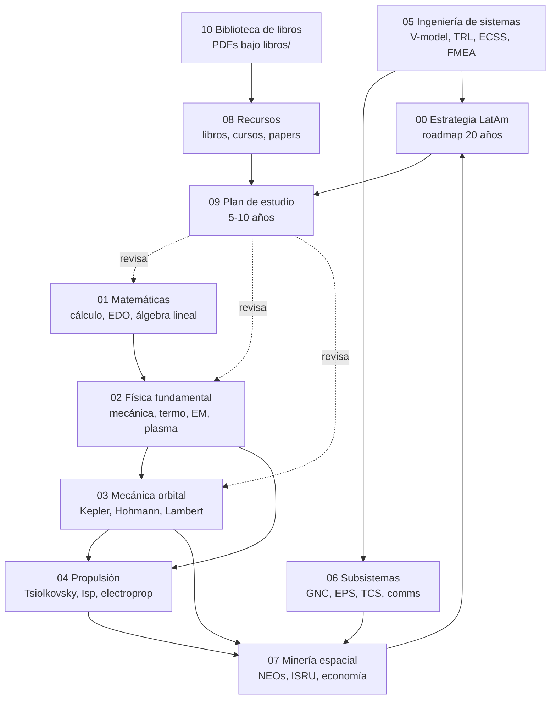
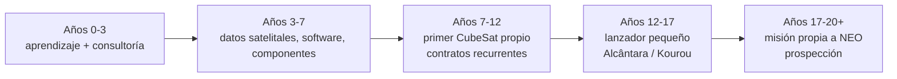
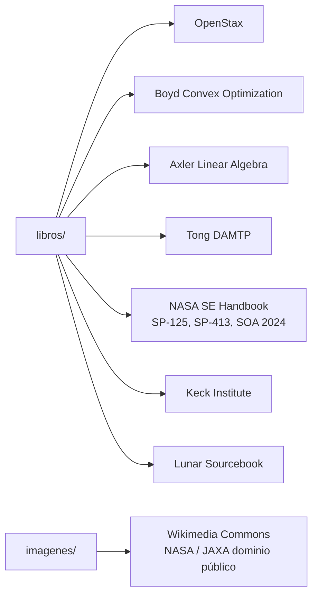

# Biblioteca Espacial LatAm

Mapa de ruta técnico, estratégico y de aprendizaje para construir una startup de exploración y minería espacial desde Latinoamérica, con horizonte de 20 años.

Esta biblioteca no es un libro cerrado — es una **semilla navegable**. Cada archivo es un punto de partida denso con ecuaciones, números, referencias a literatura primaria y decisiones estratégicas fundamentadas. La profundización real se hace con los libros, cursos y papers que se citan.

## Filosofía

1. **La física no negocia**. La ecuación del cohete, el Δv requerido para llegar a un asteroide, el presupuesto energético de un spacecraft — eso es idéntico en São Paulo o en Hawthorne. La ingeniería es universal.
2. **La estrategia sí es geográfica**. Capital disponible, talento, regulación, cadena de suministro, ventajas de latitud — eso es específico de LatAm y debe anclarse en esa realidad.
3. **Horizonte escalonado**. 20 años no es suficiente para competir en lanzadores pesados ni para extracción de recursos asteroidales. Sí lo es para ser un actor especializado relevante en nichos con barreras de entrada explotables: prospección, servicios de datos, componentes, payloads especializados, lanzadores pequeños equatoriales.
4. **Revenue antes que gloria**. Nadie financia una misión a 2 UA sin track record. Se empieza ganando plata con servicios terrestres, se reinvierte en upstream, se compite donde la ventaja es real.

## Orden de lectura sugerido

| # | Archivo | Propósito |
|---|---------|-----------|
| 00 | `00-estrategia-latam.md` | Roadmap 20 años, modelo de negocio, financiamiento, regulación, precedentes LatAm |
| 01 | `01-matematicas.md` | Cálculo, EDO, álgebra lineal, métodos numéricos, cuaterniones, optimización |
| 02 | `02-fisica-fundamental.md` | Mecánica, termodinámica, EM, fluidos, plasma — ecuaciones que vas a usar |
| 03 | `03-mecanica-orbital.md` | Kepler, elementos orbitales, Hohmann, Oberth, Lambert, Clohessy-Wiltshire, L-points |
| 04 | `04-propulsion.md` | Tsiolkovsky, Isp, ciclos, electroprop, cálculos reales de misión |
| 05 | `05-ingenieria-sistemas.md` | V-model, TRL, ECSS, FMEA, revisiones, presupuestos de misión |
| 06 | `06-subsistemas.md` | GNC, EPS, TCS, estructuras, comms — budgets y ecuaciones clave |
| 07 | `07-mineria-espacial.md` | Tipos de asteroides, Δv a NEOs, ISRU, economía real, regulación |
| 08 | `08-recursos.md` | Libros canónicos, cursos, software libre, comunidades LatAm, papers |
| 09 | `09-plan-estudio.md` | Secuencia concreta de 5-10 años para aprender lo anterior |
| 10 | `10-biblioteca-libros.md` | Índice de PDFs libres bajo `libros/` y diagramas bajo `imagenes/`, con licencias |

## Contenido descargado

- **`libros/`** — ~20 PDFs de obras con licencia libre o dominio público: OpenStax, Boyd, Axler, Tong (DAMTP), NASA (SE Handbook, SP-125, SP-413, SOA 2024), Keck Institute, Lunar Sourcebook y más. Ver [10-biblioteca-libros.md](10-biblioteca-libros.md) para índice completo con niveles y licencias.
- **`imagenes/`** — diagramas y fotos de Wikimedia Commons (NASA/JAXA dominio público, CC-BY-SA): órbitas, ciclos de motor cohete, V-model, TRL, asteroides visitados. Embebidas en los módulos correspondientes.

## Horizonte honesto

- **Años 0-3** — Vos aprendés, construís red, hacés consultoría/servicios. La empresa probablemente aún no existe.
- **Años 3-7** — Primera línea de producto: datos satelitales / software / componentes CubeSat / ground stations.
- **Años 7-12** — Primer hardware propio en órbita (CubeSat o bus pequeño). Certificación, contratos recurrentes.
- **Años 12-17** — Lanzador pequeño (dedicated smallsat) aprovechando Alcântara / Kourou / partnerships. Payloads avanzados.
- **Años 17-20+** — Misión propia a NEO (prospección, no extracción). Partners internacionales.

**La extracción de recursos asteroidales como negocio rentable no está en la ventana de 20 años** para nadie, ni para ustedes ni para AstroForge ni para TransAstra. Lo que sí está: ser el proveedor líder en información de prospección, simulación de operaciones, payloads espectroscópicos. Ahí el juego es ganable.

## Arquitectura

La biblioteca está organizada como una secuencia numerada donde cada módulo apoya a los siguientes. Las matemáticas y la física fundamental son el prerrequisito duro de todo lo demás; la estrategia LatAm se alimenta tanto de la ingeniería como del contexto de negocio.

### Mapa de dependencias entre módulos

### Horizonte temporal de la startup

### Recursos externos referenciados

## Cómo mantener esta biblioteca

- Cada vez que leas un libro de la lista, agregá notas en el archivo correspondiente.
- Cada vez que hagas un cálculo real de misión, documentalo como ejemplo resuelto.
- Cada seis meses, actualizá `00-estrategia-latam.md` con lo que cambió en el ecosistema (lanzamientos, ronda de una competencia, regulación nueva).
- `09-plan-estudio.md` es tu checklist personal — actualizalo a medida que completás módulos.

## Nota sobre esta versión inicial

Esta biblioteca fue generada como punto de partida. Contiene fórmulas, cifras y referencias correctas al momento de escritura pero **no sustituye la literatura primaria**. Cada sección apunta a los libros y papers de referencia. Usala como índice navegable para saber qué estudiar y en qué orden, no como sustituto del estudio.
